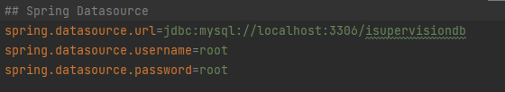
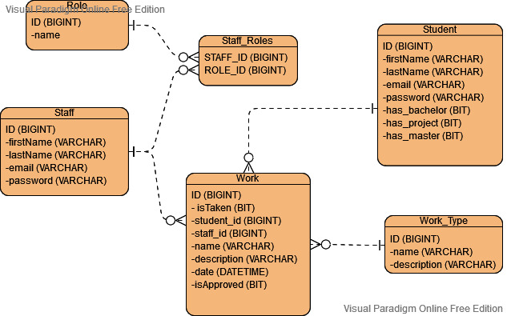

# Getting Started

This project is built on spring boot framework using preconfigured Tomacat server. There are 
some other technologies implemented such as Spring Security for authentication and authorization, 
Spring data JPA for storing data, MySQL connector to establish connection between application 
database and Thymeleaf for frontend.
 
To start the application you need to prepare a database in MySQL named **isupervisiondb** 
running on port 3306 (look at the picture below) or you could use your own empty database,
but then you should change database-url with you corresponding and change username and 
password with yours.

## Database
The database does not need any tables, because spring boot take care of it and create 
them automatically.  

In *application.properties* could be defined the database URL, username and password.

If the database is connected and localhost:8080 is not already taken the application
is ready to be started. If it is needed the port could be changed adding **server.port=8081**
to *application.properties* file

There is provided example SQL data at **src/main/resources/static/example-sql-data.txt**

***

***

## Roles
>**With the first start of the program all the tree roles are created
>automatically from Spring Boot**

Roles are part of Spring security and are used for authorization to give access to specific 
files or actions after the user is authenticated *(Logged in)*.
In my Project I use them to create custom URL redirect strategy to distinguish student from staff
and create homepage for each of them.

### *ROLE_STUDENT*
User have 3 types of works *PROJECT < BACHELOR < MASTER* and he sees and is able to take 
only related to his status works. Student can only take free and approved works and only 
one per type.

### *ROLE_ASSISTANT*
User have overview over all the works sorted by type and term date. He could add some new 
work entities which are **NOT** approved, delete these one and see detailed information about 
each one. Assistant and admin could set limits for each type work. 

### *ROLE_ADMIN*
User have overview over all the works sorted by type and term date and can perform all the 
action without looking to the approve-status

***

## Architecture

Architecture is divided in 3 parts Web Layer, Service Layer and Repository Layer.

### Web Layer
This layer contains the controllers, form validation and data transfer objects. It is responsible for 
request handling, its validation, creation of the DTOs and passing information to the service 
layer using them.

### Service Layer
Service layer implements business logic. It is responsible for the password encryption using
BCryptPasswordEncoder, creation of the entities including CustomUserPrincipal, performing 
different actions and sending objects and requests to repository layer.

### Repository Layer
Repository layer extends JpaRepository and is responsible for getting, updating, saving
and deleting objects from database. 

Graphical illustration of ER-Diagram of the database see below.

***

## TODOs

* Adding email-verification 
* Replacing Thymeleaf with React.js
* Rework of the DB removing WorkLimits and replacing them with Semester and Programs
* Adding Notes containing sub-notes using recursion

Link to the study-git repository: [ISupervision](https://github.com/YordanovTihomir/ISupervision)